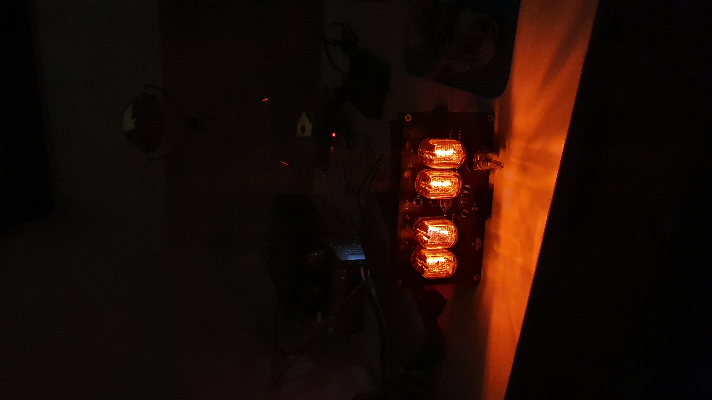
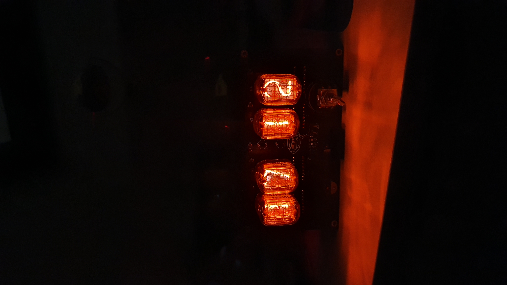
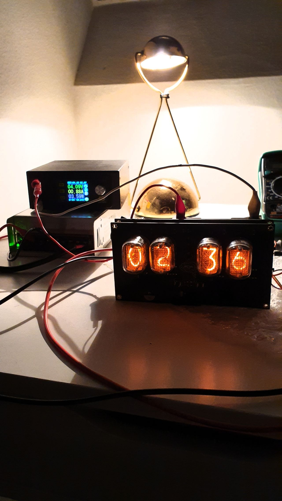
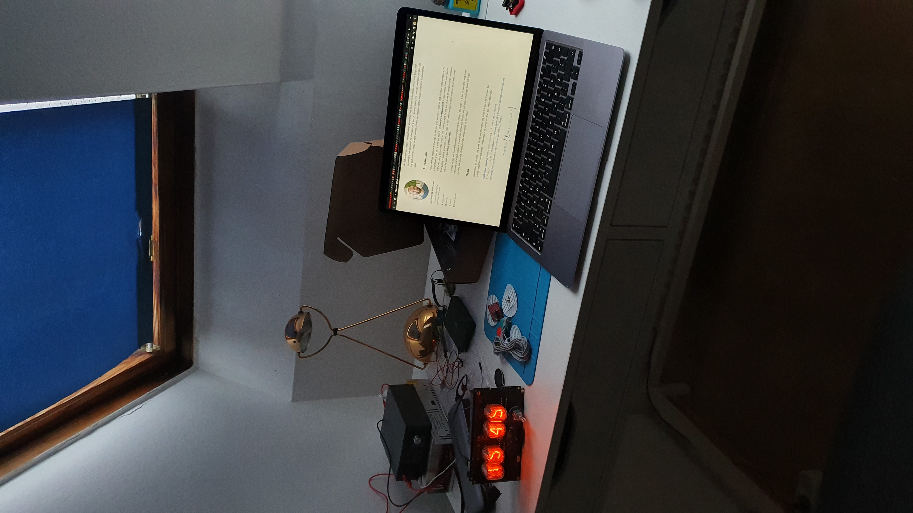
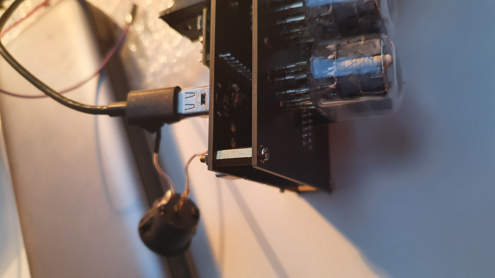
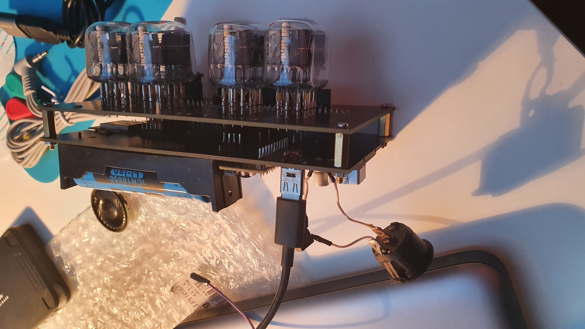
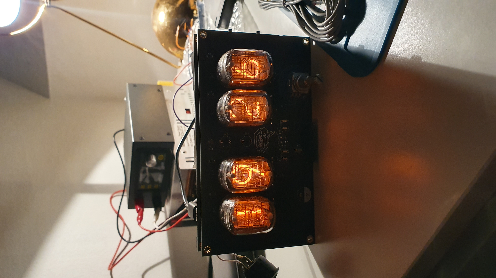
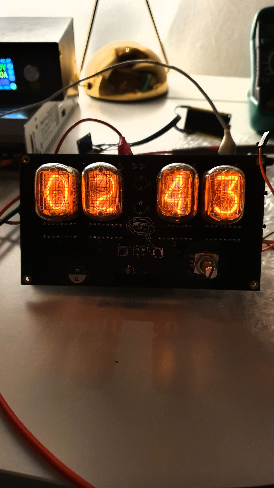

# Retro style desk clock

Powered via 5V USB-C interface. Provides a 2S Li-Ion battery pack for autonomous operation.\
Made with 4 IN-12A Nixie Tubes denoting hours & minutes, and smaller INS-1 tubes as the dots.\
Enabled with Wi-Fi connectivity for automatic time synchronization using the Network Time Protocol (NTP).\
Functions as a simple clock and an alarm clock. User interface for the alarm setting is implemented with 2 Set/Unset buttons and rotary encoder.\
There's an MP3-player onboard any melody can be programmed and set as an alarm call.

## Gallery

More photos

## Further steps
* Enclosure design
* Add remote app control / IOT host node connectivity
* Better power design to get rid of inrush current issue preventing the device to start up sometimes without USB power attached
